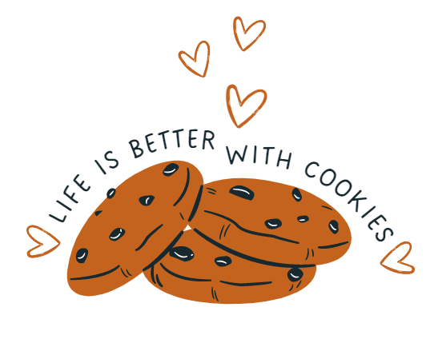

# Bootcamp-Project-1-Python-Farah-Alosaimi

## cookies store program

### Overview: An online website that shows different events. The visitor should be able to do the following tasks for the store to function properly. As a visitor, I should be able to do the following:

The given code represents a cookie store program that allows users to view available cookie types, add cookies to a shopping cart, remove cookies from the cart, display the cart contents, calculate the total price of the cart, and exit the program.

The program uses a dictionary called cookies to store available cookie types and their prices. The keys represent the cookie types, and the values represent their prices. There is also a list called cart to represent the shopping cart. Each item in the cart list is a tuple containing the cookie type and the quantity.

### The code includes several functions:

- isplay_cookie_types(sort_order): This function displays the available cookie types sorted by price in either ascending or descending order, based on the sort_order parameter.

- add_to_cart(cookie_type, quantity): This function adds cookies to the cart. It checks if the given cookie_type is valid, and if so, adds the specified quantity of cookies to the cart.

- remove_from_cart(cookie_type, quantity): This function removes cookies from the cart. It searches for the given cookie_type in the cart and removes the specified quantity of cookies if they exist. It also handles cases where the quantity is insufficient or the cookie type is not found.

- display_cart(): This function displays the contents of the cart, showing the cookie types and their respective quantities.

- calculate_total_price(): This function calculates the total price of the items in the cart based on the prices specified in the cookies dictionary.

The main program loop allows users to select options from a menu by entering a number. Depending on the chosen option, the corresponding function is called to perform the desired action. The loop continues until the user selects the "Exit" option (number 7).
