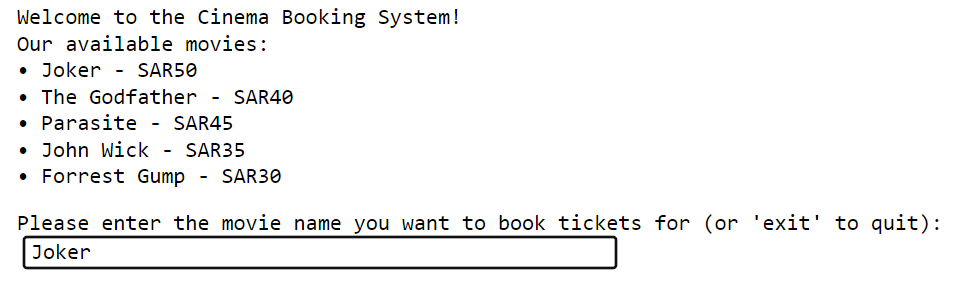
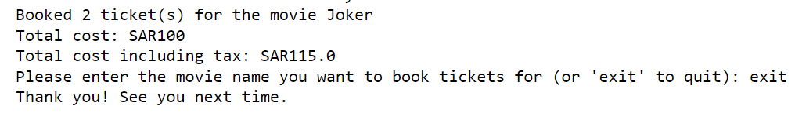

# Cinema Booking System
This program is a **simple cinema booking system** that allows users to view available movies and book tickets for a selected movie.


## Movie List and Ticket Prices
The movie list and ticket prices are defined using a dictionary. Each movie is associated with its ticket price:

```python
movies = {
    "Joker": 50,
    "The Godfather": 40,
    "Parasite": 45,
    "John Wick": 35,
    "Forrest Gump": 30
}
``` 
## Tax Calculation
A lambda function is used to calculate the tax on the total ticket cost. The tax is set at 15% of the ticket cost:

```python
tax = lambda amount: amount * 0.15
``` 

## Displaying Available Movies
The display_movies() function is responsible for showing the list of available movies to the user:
```python
def display_movies():
    print("Our available movies:")
    for movie, price in movies.items():
        print("• " + movie + " - SAR" + str(price))
``` 
## Booking Tickets
The book_tickets() function is used to book tickets for a selected movie. It takes the movie name and the number of tickets as input. It then calculates the total cost, adds the tax amount, and displays the booking details:
```python
def book_tickets(movie, num_tickets):
    if movie in movies:
        price = movies[movie]
        total_cost = price * num_tickets
        total_cost_with_tax = total_cost + tax(total_cost)
        print("Booked", num_tickets, "ticket(s) for the movie", movie)
        print("Total cost: SAR" + str(total_cost))
        print("Total cost including tax: SAR" + str(total_cost_with_tax))
    else:
        print("Sorry, the movie is not available.")
``` 
## Main Program
The main program welcomes the user to the cinema booking system, displays the available movies using display_movies(), and prompts the user to enter the movie they want to book tickets for. It continues to take user input until the user chooses to exit:
```python
print("Welcome to the Cinema Booking System!")
display_movies()

while True:
    movie = input("Please enter the movie name you want to book tickets for (or 'exit' to quit): ")

    # Capitalize the movie name entered by the user for case insensitivity
    movie_capital = movie.title() 

    if movie_capital.lower() == "exit":
        print("Thank you! See you next time.")
        break

    if movie_capital in movies:
        num_tickets = int(input("Please enter the number of tickets you want to book: "))
        book_tickets(movie_capital, num_tickets)
    else:
        print("Sorry, the movie is not available.")
``` 

## Output:
A welcoming message to the user, displaying the available movies.


Prompting the user to enter the number of tickets they want to book.


Confirmation of the ticket booking, displaying the total cost and the cost including tax. It then prompts the user to enter the movie name they want to book tickets for, and if they enter "exit," the program ends.

###Enjoy! 🎬

## Resources 
[w3schools](https://www.w3schools.com/python/python_lambda.asp) <br>
[markdownguide](https://www.markdownguide.org/cheat-sheet/)


