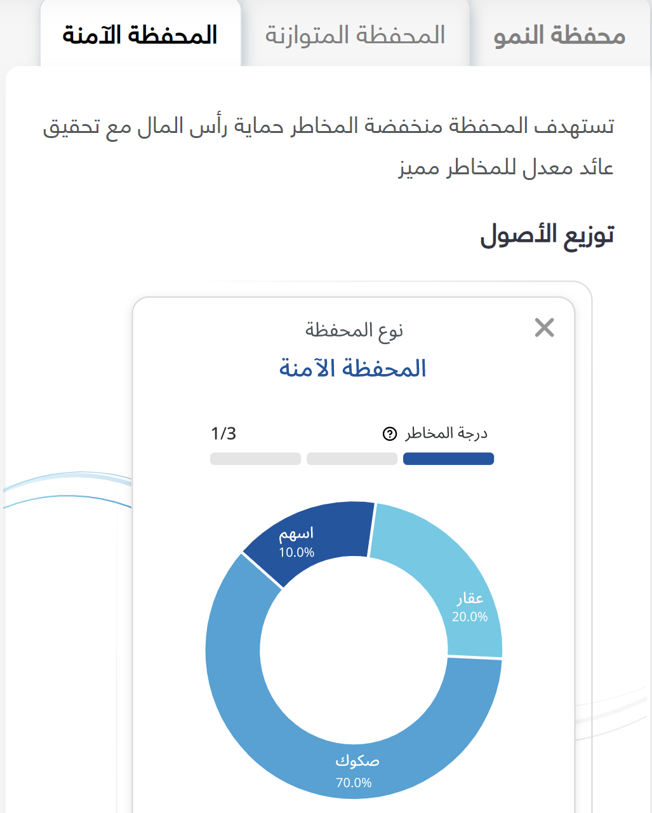
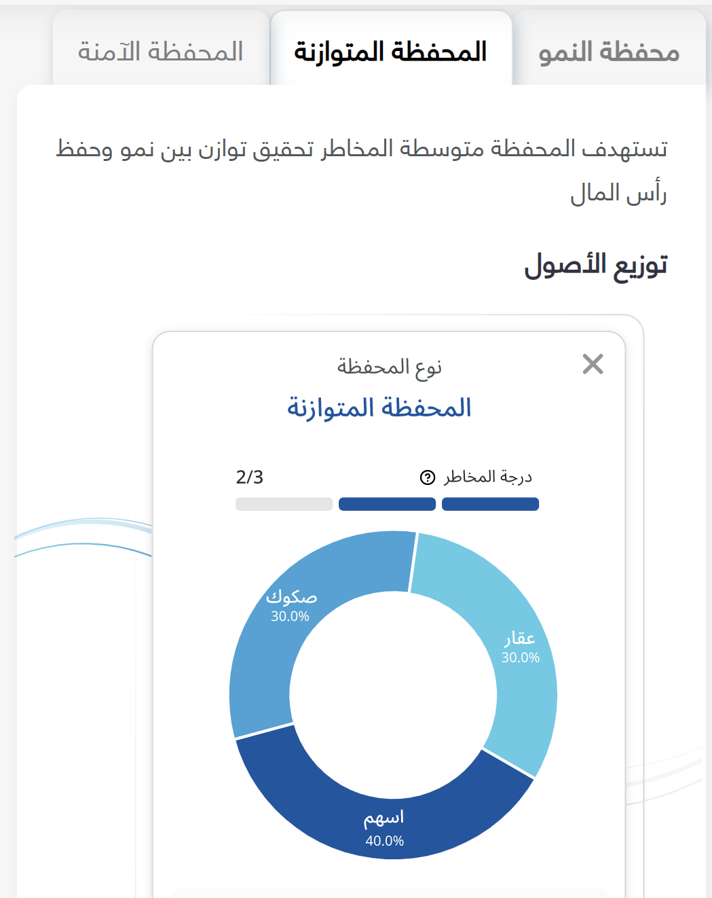
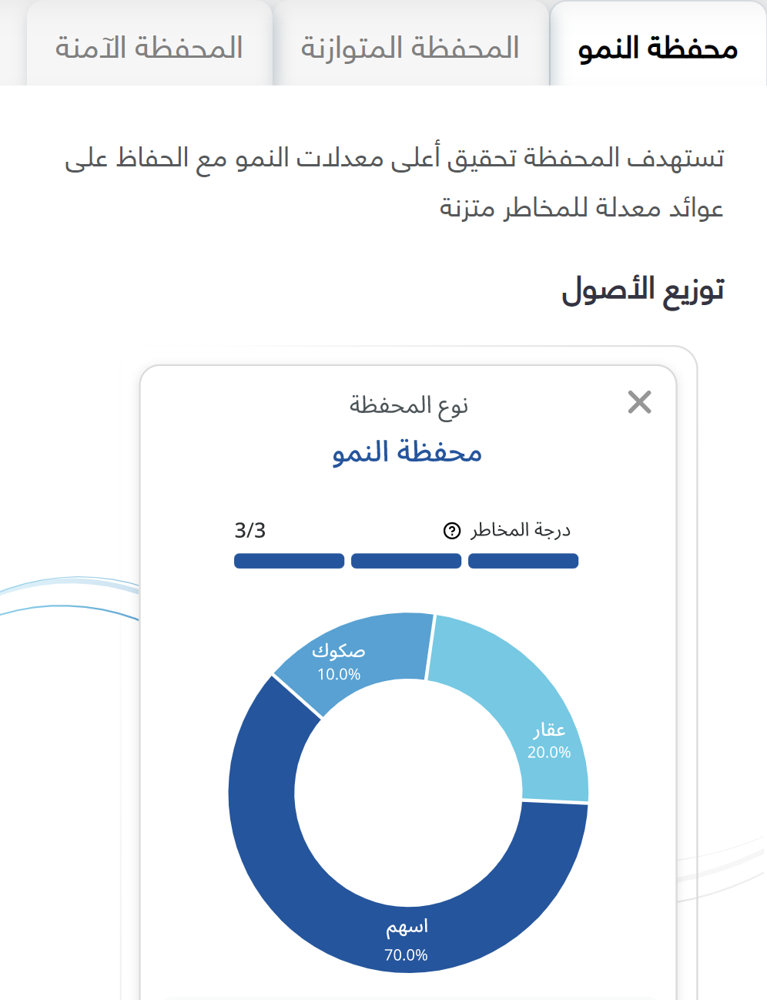

# Investment
## project Describe 
### Ask the user if he wants to invest by yourself or if he wants a company to invest his money if he chooses a company I will suggest a company that invests his money and I add the website of the company but if he chooses to investment by its own I will ask him 7 questions to identify which risk degree is appropriate for him .
**the Questionnaire from this website**
[Risk Tolerance Questionnaire](https://s21.q4cdn.com/198919461/files/doc_downloads/enterprise-components/assessment_reports/IWT_CurrentReport_RiskToleranceQuest.pdf)

### and I will Suggest a plan depending on the Risk degree 

**the investment plan from Abyan Capital :**

- use the function for the Risk Tolerance Questionnaire & use condition and while loop for validation input &data type is an integer
- use a dictionary for the Investment company the key is the name of the company and the value is the website &for loop to show the dict of cumpany more clearly&data type String&sequence type(dictionary)
- use lambda for the full name
